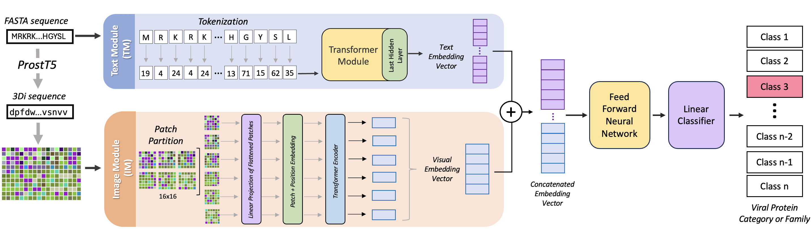
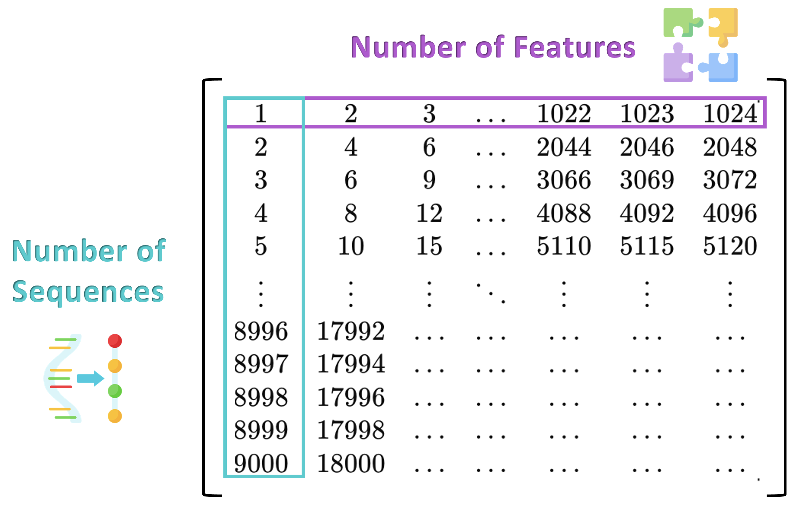

# Unveiling the Viral Functional Dark Matter through Artificial Intelligence 

Juanita Puentes Mozo<sup>* 1</sup>, Camilo Garcia Botero<sup>1</sup> & Alejandro Reyes Muñoz<sup>1</sup>

<sup>1</sup> [Computational Biology and Microbial Ecology](https://cienciasbiologicas.uniandes.edu.co/es/investigacion/biologia-computacional-y-ecologia-microbiana), Department of Biological Sciences, Universidad de los Andes. Bogotá, Colombia <br/>

<p align="center">
</p>

___________


<p align="center">

</p>

_______
> Our proposed method leverages text embeddings from Large Language Models (LLMs) and visual features from Visual Transformers to classify viral proteins using 3Di FASTA representations. The model inputs are the FASTA sequences of amino acids from viral proteins, which are processed by the Text Module (TM). Each FASTA sequence is tokenized using BioTransformers and analyzed by ProteinBERT's transformer module. Additionally, the FASTA sequence is converted by ProstT5, a protein language model (pLM) that translates between protein sequences and structures, encoding protein structures as token sequences based on the 3Di-alphabet from the Foldseek 3D-alignment method. This sequence is then converted into a PNG image and processed by a Visual Transformer (ViT). The embeddings from both modules are concatenated and classified using a Feed Forward Network.


### What is a transformer?

Transformers are an AI language model that has significantly impacted speech recognition and automated chatbots. They are now recognized as a revolutionary method for understanding protein languages, providing a novel approach to studying and designing proteins. Transformers were first introduced in the paper "Attention is All You Need." This blog post offers a detailed exploration of the transformer architecture and the underlying mathematics.

### Why transformers for protein ?

Proteins are essential molecules that carry out vital functions in all living organisms. They are composed of one or more chains of amino acids. Despite there being only 20 distinct amino acids, their various combinations have produced thousands of functional proteins in humans. By considering amino acids as words and proteins as sentences, transformers can be utilized to interpret the language of proteins. When trained on billions of protein sequences identified across numerous species, a transformer can discern meaningful amino acid sequences and suggest new combinations from a linguistic standpoint.
 
<p align="center">
  
</p>

<p align="center">
  
</p>


Using a transformer model trained in protein language to analyze a specific sequence can reveal extensive details about the protein. As demonstrated in the earlier example, the transformer can identify which amino acids are crucial and must be present in the protein from a linguistic perspective. This insight is especially valuable for determining amino acid regions critical to the protein's function or stability.

# 0. Getting started

## Installation
It is recommended to work with conda environments in order to manage the specific dependencies of this package.
The `bio-transformers` package can be found on [pypi](https://pypi.org/project/bio-transformers/).

Please note that you are suppose to have a correct cuda/torch installation before installing this library.


### Work with conda environment

1. Install [Miniconda](https://docs.conda.io/en/latest/miniconda.html) or [Anaconda](https://www.anaconda.com/products/individual)

2. Create a virtual environment and activate it.

```bash
  conda create --name bio-transformers python=3.7 -y && conda activate bio-transformers
```

3. Install the package in environment.

```bash
  pip install bio-transformers
```

### Environment for developing

Conda:

1. Clone this git repo via HTTPS or SSH:

 ```bash
 git clone https://github.com/DeepChainBio/bio-transformers
 cd bio-transformers
 ```

2. Create developement environment based on the yaml file.

```bash
conda env create -f environment_dev.yaml
conda activate bio-transformers-dev
```

3. Install package and pre-commit hooks.

```
pip install -e .
pre-commit install
```

## Data

To download the dataset, please click the provided [link](https://drive.google.com/drive/folders/1vdIfHs8GdB_JMCP1g_U9gQ9yKoMKsd90?usp=sharing) and ensure that you place the downloaded folder at the same level as all the scripts within this directory. 

The folder contains two types of files: **refseq-pharokka-proteins.faa**, which includes all the FASTA amino acid sequences of the viral proteins, and **refseq-wide-all-phrogn.tsv**, which lists all the sequence IDs along with category-level and family-level annotations.


# 1. Data Pre-Processing
To improve the accuracy of our analysis, we filtered out PHROG families with fewer than 10 sequences. To apply this filtering, run the following command:

```
python stats.py
```

# 2. Embeddings Extraction

This section will allow you to extract the features from the Text Module (TM) and from the Image Module (IM). These embeddings are essential representations that will enable us to classify each viral protein within the category-level (9 classes) and family-level (1159 classes).

## 2.1 Text Module (TM)

The embedding of a an object is a representation of the object in a lower dimensional space. In this lower space, it is easier to manipulate, visualize, and apply mathematical functions on proteins' projection. Embeddings model will take a sequence of amino acids in input (string) and return a vector of lower dimension.

You can choose a backend and pass a list of sequences of Amino acids to compute the embeddings.
By default, the ```compute_embeddings``` function returns the ```<CLS>``` token embeddings.

Here is an example of how you can compute the embeddings for a sample AA FASTA sequence:

```python
from biotransformers import BioTransformers

sequences = [
        "MKTVRQERLKSIVRILERSKEPVSGAQLAEELSVSRQVIVQDIAYLRSLGYNIVATPRGYVLAGG",
        "KALTARQQEVFDLIRDHISQTGMPPTRAEIAQRLGFRSPNAAEEHLKALARKGVIEIVSGASRGIRLLQEE",
    ]

bio_trans = BioTransformers(backend="protbert")
embeddings = bio_trans.compute_embeddings(sequences, pool_mode=('cls','mean'),batch_size=2)

cls_emb = embeddings['cls']
mean_emb = embeddings['mean']
```

To run the embeddings on the PHROGs dataset run the following command. Consider we took a subsample of 350 sequences per category (9) due to our computational limitations. Feel free to change this number to fit your resources.

```
python main.py
```
Running this command will allow you to get the text embeddings. They are going to be stored on a **.json ** file which includes a matrix containing the embeddings. This matrix has a number of rows equal to the number of sequences and number of columns equal to the features we have that are 128. 

<p align="center">

</p>


## 2.1 Image Module (IM)
